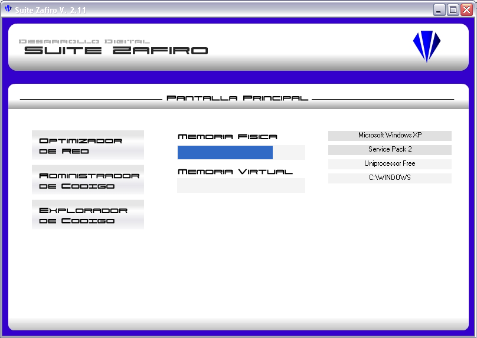
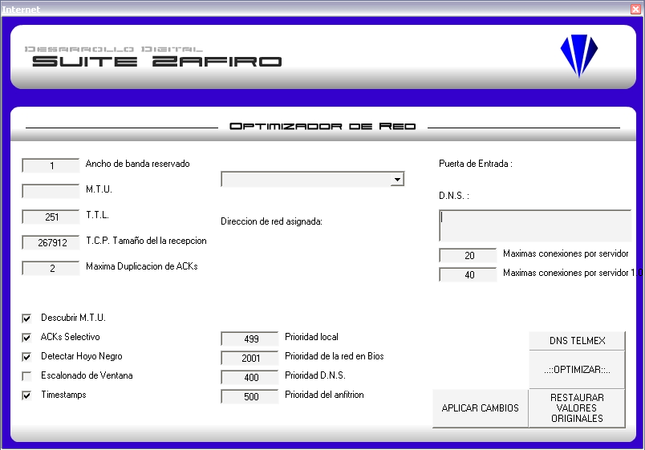
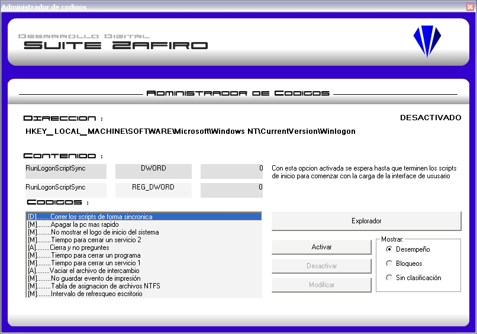
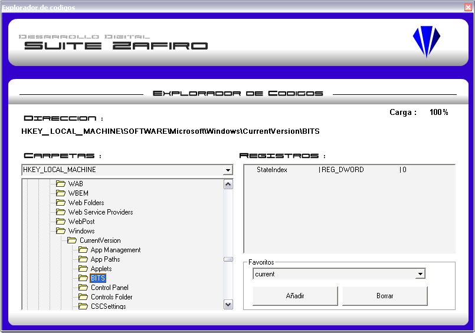

# Proyecto Zafiro

Permite realizar ajustes al registro del sistema Windows mejorando su desempeño o aplicando bloqueos al equipo. Cuenta con una base de datos de ajustes prestablecidos y un apartado para optimizar las conexiones a internet.

## Empezando

Estas instrucciones te ayudaran a obtener una copia del proyecto para propósitos de desarrollo e incluye una versión compilada para ejecutar en tu sistema.

### Requisitos previos

Este proyecto fue creado para Windows XP de 32 bits, puede ejecutarlo en una máquina virtual como Virtual Box o VMWare. 

### Instalación

Este software es portable y se ejecuta sin requerir instalación. Sin embargo, como modifica valores del sistema es necesario ejecutarse con privilegios de administrador.

Dentro del directorio raíz se encuentra la versión ejecutable

```
bin/Suite Zafiro.exe
```

## Descripción del programa

La aplicación cuenta con tres secciones para realizar diferentes ajustes al sistema

### Optimizador de red

Muestra opciones predefinidas para realizar ajustes a la tarjeta de red y agilizar la conexión a internet

```
Pantalla principal > Optimizador de red
```

### Administrador de códigos

Permite la modificación de parámetros en el registro de sistema para habilitar o deshabilitar funciones específicas que proveen de seguridad, velocidad o personalización

```
Pantalla principal > Administrador de códigos
```

### Explorador de códigos

Permite navegar entre los registros de sistema con la finalidad de efectuar cambios no contemplados entre las opciones de esta aplicación

```
Pantalla principal > Explorador de códigos
```

## Herramientas usadas

* [MS Visual Basic 6.0](https://msdn.microsoft.com/en-us/vstudio/aa662927.aspx) - El lenguaje utilizado
* [MS Access 2000](http://office.microsoft.com/access) - Gestor de base de datos
* [MS ADO Data Control](https://msdn.microsoft.com/en-us/library/aa226568(v=vs.60).aspx) - Componente para la conexión a BD

## Referencias técnicas
* [RegSetValueEx](http://msdn2.microsoft.com/en-us/library/ms724923.aspx) - Microsoft Developer Network
* [RegQueryInfoKey](http://msdn2.microsoft.com/en-us/library/ms724902.aspx) - Microsoft Developer Network
* [RegDeleteKeyEx](http://msdn2.microsoft.com/en-us/library/ms724847.aspx) - Microsoft Developer Network
* [RegCreateKeyEx](http://msdn2.microsoft.com/en-us/library/ms724844.aspx) - Microsoft Developer Network
* [RegDeleteKey](http://msdn2.microsoft.com/en-us/library/ms724845.aspx) - Microsoft Developer Network
* [RegEnumValue](http://msdn2.microsoft.com/en-us/library/ms724865.aspx) - Microsoft Developer Network
* [RegOpenKeyEx](http://msdn2.microsoft.com/en-us/library/ms724897.aspx) - Microsoft Developer Network
* [RegCloseKey](http://msdn2.microsoft.com/en-us/library/ms724837.aspx) - Microsoft Developer Network
* [RegEnumKeyEx](http://msdn2.microsoft.com/en-us/library/ms724862.aspx) - Microsoft Developer Network
* [RegDeleteValue](http://msdn2.microsoft.com/en-us/library/ms724851.aspx) - Microsoft Developer Network
* [RegQueryValueEx](http://msdn2.microsoft.com/en-us/library/ms724911.aspx) - Microsoft Developer Network
* [Manual técnico](add/SZAF10001.pdf) - Módulo de conexión al registro de sistema

## Contribuyendo

Por favor lea [CONTRIBUTING.md](https://gist.github.com/PurpleBooth/b24679402957c63ec426) para obtener detalles sobre nuestro código de conducta y el proceso para enviarnos solicitudes de integración.

## Autores

* **Angel González** - *Trabajo inicial* - [mgrc45](https://github.com/mgrc45)

Vea también la lista de [contribuyentes](contributors.md) que participaron en este proyecto.

## Licencia

Este proyecto está licenciado bajo la licencia MIT. Consulte el archivo [LICENSE](LICENSE) para obtener más información.

## Capturas de pantalla
<p>




</p>
